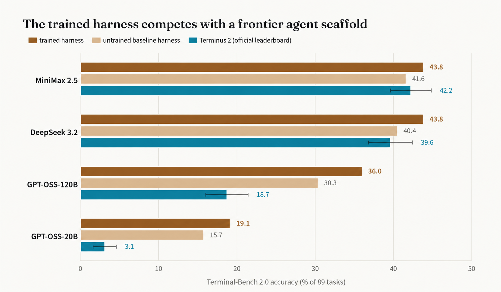
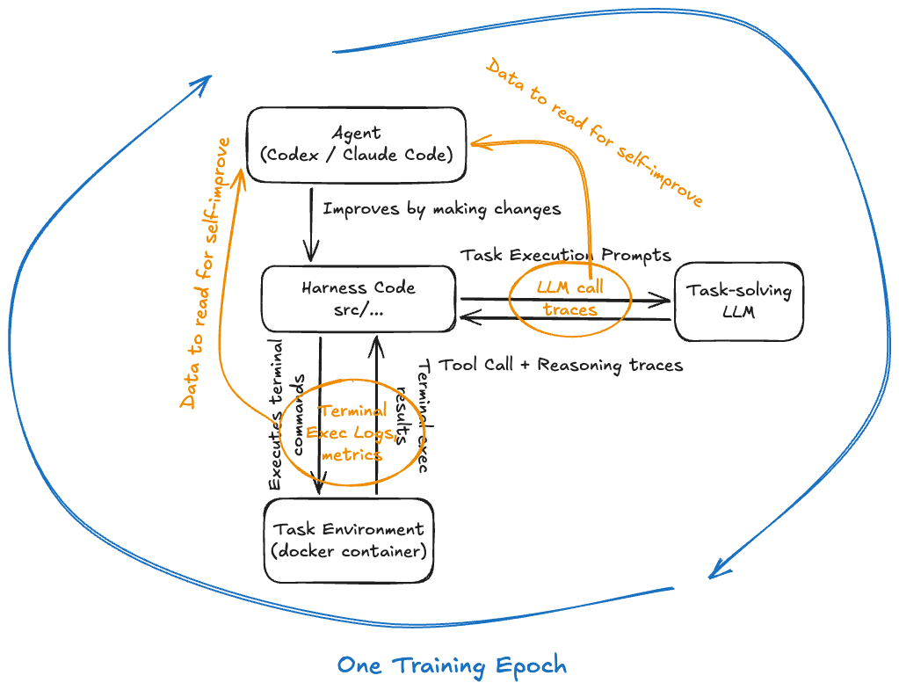
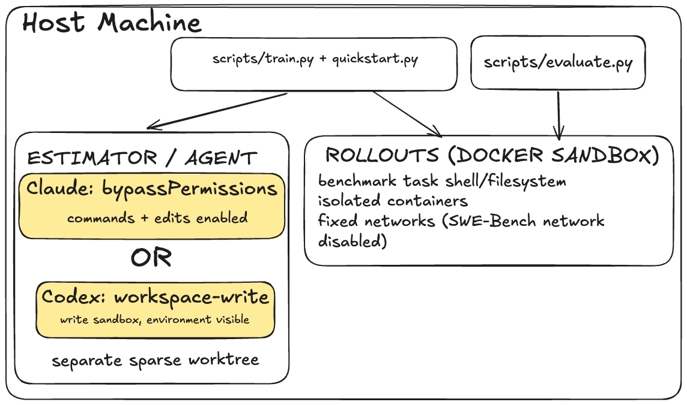

# Harness Training

**A PyTorch-style harness trainer**. The LLM model stays frozen, the harness around it is being trained, including the prompts, context management, tools, and repair loop.

```python
for loss in trainer.epochs(30):
    loss.backward()   # deposit the verdict on harness.grad
    optimizer.step()  # fast-forward HEAD to the winner, or reject
```

The harness is one editable file `src/policy/core.py`. Each epoch, the Estimator in `src/trainer/estimator.py` proposes one diff to it. The diff is incorporated into `core.py` that will be measured against the current baseline on a panel of tasks, and a criterion decides whether the change (git commit) is promoted. `git log` is the candidate promotion history. Every candidate, promoted or rejected, is kept under `refs/candidates/`, and each measured run under `refs/experiments/runs/`.

| PyTorch | Harness Training |
| --- | --- |
| `Parameter.data` | HEAD's commit sha |
| forward pass | run the task panel against the candidate harness |
| `loss.backward()` | write the candidate-vs-baseline verdict on to `harness.grad` |
| `optimizer.step()` | fast-forward HEAD (promotion) or no-op (rejection) |


## Train the harness once, freeze it, then lift model capability generally

For more details, see the blog post: https://www.henrypan.com/blog/2026-07-18-harness-training

The "trained harness" is frozen, only the task-solving LLM for these evaluations is changed.



## Quick start

Train the harness on two Terminal-Bench tasks, then evaluate it on two held-out tasks. 

**Requirements:** Python 3.13, Docker with `linux/amd64` container support and the Compose plugin, the `claude` CLI (it proposes the harness changes; swap in `codex` with `CodexAgentBackend`), local or remote OpenAI-compatible inference server with tool calling.

Example small models:
| Model | Quantized weights | Weight size | Example config |
| --- | --- | --- | --- |
| [Qwen3.5-4B](https://huggingface.co/Qwen/Qwen3.5-4B) | [Q4_K_M GGUF](https://huggingface.co/unsloth/Qwen3.5-4B-GGUF) | ~2.7 GB | [`config/llm/qwen35_local.yaml`](config/llm/qwen35_local.yaml) |
| [GPT-OSS-20B](https://huggingface.co/openai/gpt-oss-20b) | [MXFP4 GGUF](https://huggingface.co/ggml-org/gpt-oss-20b-GGUF) | ~12 GB | Edit [`config/llm/local.yaml`](config/llm/local.yaml) |

Use either [Ollama](https://docs.ollama.com/quickstart) or [llama.cpp](https://github.com/ggml-org/llama.cpp/blob/master/tools/server/README.md) or anything you like to expose the model through an OpenAI-compatible endpoint. Follow their platform-specific installation instructions.

**The server must decode one request at a time** (`--parallel 1` for llama.cpp, `OLLAMA_NUM_PARALLEL=1` for Ollama, whatever caps concurrent requests elsewhere): high concurrency batched decode is non-deterministic, so the run cannot be attributable to the candidate harness change. See [Determinism](#determinism). On the client side, we can still set `max_rollout_concurrency`. You can enable batch decoding (higher concurrency) later, which I recommend following [SGLang Deterministic Inference](https://docs.sglang.io/docs/advanced_features/deterministic_inference) for larger scope training.

**Point the quickstart at your server** in [`config/llm/local.yaml`](config/llm/local.yaml), the one file both quickstart configs extend, then commit it — the trainer measures committed configs only. `model_name` is the id your server advertises, and `tokenizer_name` is the HuggingFace Hub id, which is required for counting tokens for context length management.


**Did you read above? If so:**

```bash
# Install uv (if not already installed)
curl -LsSf https://astral.sh/uv/install.sh | sh

# install dependencies and create virtual environment
uv sync

# API keys. The shipped LOCAL_LLM_API_KEY placeholder suits any server that
# ignores auth; replace it if yours checks keys.
cp .env.example .env

# With the configured model server running:
uv run python examples/quickstart.py
```

<details>
    <summary><strong>Note</strong></summary>

  - `.env` is where keys live, and the variable must exist even when the server ignores auth — skipping the `cp` above fails preflight with `LOCAL_LLM_API_KEY is not set`. If your server checks keys, replace the shipped placeholder with the real one, or it answers `401 Invalid API key`.

  - The default Terminal-Bench network cache reaches host services through `host.docker.internal`. See the [network-cache runbook](src/env/netcache/README.md) for the full host contract. You can decide whether to use the cache (default on to speed up quickstart). Training leaves the cache services and their volumes running. To stop them, keeping the cached data: `docker compose -f src/env/netcache/docker-compose.caches.yml down` — add `-v` to delete the volumes too.

  - Run it on a "experiment" branch: harness change promotions fast-forward your checkout, `git log` shows the candidate commit as your new baseline.

  - On first use, the model server downloads its weights and the quickstart downloads the task images. Runtime depends mainly on the selected model and hardware. Subsequent runs reuse the baseline (unless the harness drifted from baseline git commit SHA).

  - Run the quickstart in a disposable VM or container, a separate OS account, or a machine dedicated to agent workloads. The estimator runs as a host process with your inherited shell environment; see [Sandbox Boundaries](#sandbox-boundaries).

</details>

## How a training loop works

```python
# The criterion decides "goodness": no task the baseline solved may regress, and
# the candidate must solve more. Exact ties fall to secondary metrics.
criterion = StrictPareto()
# The optimizer just applies that verdict: fast-forward HEAD, or no-op.
optimizer = GreedyMonotonic()

trainer = Trainer(
    config_path="config/train_harness.yaml",
    estimator=AgenticEstimator(
        # you can specify Codex or Claude Code CLI or even switch out the AgenticEstimator with another estimator
        backend=CodexAgentBackend(
            trace_dir=Path("experiments/codex-traces"), model="gpt-5.6-sol"
        )
    ),
    criterion=criterion,
    optimizer=optimizer,
)

for loss in trainer.epochs(30):
    # Measure HEAD, propose one bounded change, then measure it.
    # Compare candidate with baseline on the same task panel.
    loss.backward()  # Record the verdict.
    optimizer.step()  # Promote or reject.
    # Save the outcome as context for the next proposal.
```



The full walkthrough is in [src/trainer/README.md](src/trainer/README.md).


## Determinism

In order for the training loop to produce useful signals across epochs. Each run's outcome must be attributable to the candidate only if everything else is deterministic: a seeded deterministic LLM inference engine, fixed container networks, deterministic environment, and a frozen network cache etc... This framework guarantees that in a couple of ways, more details in the [blog post](https://www.henrypan.com/blog/2026-07-18-harness-training/#determinism).

## Sandbox Boundaries
Always recommend to run on a isolated host machine to reduce risk. The uncertainty comes from the "Agent" proposing the harness change.




## Where things live

| path | what it is | start here to… |
| --- | --- | --- |
| [`src/policy/`](src/policy/README.md) | the harness being trained | see what a candidate may touch |
| [`src/trainer/`](src/trainer/README.md) | Trainer, Estimator, Criterion, Optimizer | write or customize a training loop |
| [`src/rollout/`](src/rollout/README.md) | the measured episode, failure taxonomy, artifacts | understand a measurement and what it leaves on disk |
| [`src/env/`](src/env/README.md) | Terminal-Bench and SWE-bench task environments | add a benchmark |
| [`src/llm/`](src/llm/README.md) | completion backends and estimator agent backends | add a model provider |
| [`src/plugins/`](src/plugins/README.md) | the three caches and determinism certification | make re-runs fast; understand certification |
| [`config/`](config/) | one YAML file = one measurement definition | copy the commented [`run_config.template.yaml`](config/run_config.template.yaml) |
| [`tests/`](tests/README.md) | the test design contract | write tests that fit |
| [`program.md`](program.md) | not framework — the operating policy `AgenticEstimator` hands its proposer and diagnoser each epoch | steer what candidates propose |

- Training: `uv run python scripts/train.py` runs the full training loop with `config/train_harness.yaml`.
- Evaluation:  `uv run python scripts/evaluate.py <config> <config2> ...`
- Small end-to-end with training and evaluation: `examples/quickstart.py`

## Extending

Two environments ship out of the box, and one model provider — any OpenAI-compatible endpoint. A new benchmark is one `DockerTaskEnv` subclass, a new provider is one `CompletionBackend` subclass plus its registry entry. Use `TerminalBenchEnv` and `SweEnv` in [`src/env/`](src/env/README.md), and `OpenAICompletionBackend` in [`src/llm/`](src/llm/README.md), as the concrete references. Task images can take tens of GB of disk.

## Example use-cases

**Bias the search toward one surface.**

```diff
# program.md
 ## Objective

+This run, propose only prompt-surface changes: system, initial, and repair prompts.
```

**Hard-limit what candidates may edit.** The patch surface is exactly the trained module's own file plus `extra_patch_paths` — the framework rejects any diff outside it. To freeze part of the harness, move it out of the trained module; it is then unreachable to candidates.

```yaml
# config/run_config.yaml
training_target:
  module: src.policy.core            # must export build_policy / build_env_action
  extra_patch_paths:
  - tests/policy/test_core_impl.py   # the only other file a candidate may write
```

**Attack one failure mode.** A panel of only the tasks that currently fail that way concentrates each epoch's signal on it:

```yaml
# config/run_config.yaml
environment:
  $include: task_panels/tool_call_failures.yaml # example task panel
```

**Re-fit the harness to a new model.** The score is a property of model + harness, so a model swap means re-baseline and retrain.

```yaml
# config/run_config.yaml
$extends:
- llm/gptoss20_openrouter.yaml   # was llm/qwen35_local.yaml
```

**Promote cheaper solves.** Tie-breaking is already on: every shipped entry point passes the benchmark's default secondary metrics. Pass your own tuple to change what breaks an exact solved-set tie, or define your own Criterion to replace the primary rule.

```python
# call in scripts/train.py

# narrow the tie-break to one signal; metrics live in src/rollout/metrics.py
criterion = StrictPareto(secondary_metrics=(StepsUsedMetric(),))

# different primary candidate promotion criterion, defined in src/trainer/loss.py
criterion = NetTaskSolve() # placeholder criterion not in codebase
```

**Drive proposals from any process.** Nothing in the `Estimator` contract says harness changes have to come from agents. You can define your own API, or an LLM panel with a judge, and each proposal goes through the same deterministic run.

```python
# scripts/train.py — Trainer(estimator=PatchQueue([...]))
class PatchQueue(Estimator):
    """A/B-test hand-written variants: you author the diffs, the loop measures them."""

    def __init__(self, diffs: list[Path]):
        self.diffs = iter(diffs)

    def propose(
        self, *, repo_root: Path, tracker: RunStore, target: TrainingTargetConfig
    ) -> None:
        subprocess.run(["git", "apply", next(self.diffs)], cwd=repo_root, check=True)

    def diagnose(self, result, *, repo_root, tracker, target) -> None:
        pass  # you are the diagnoser
```


## License

MIT
